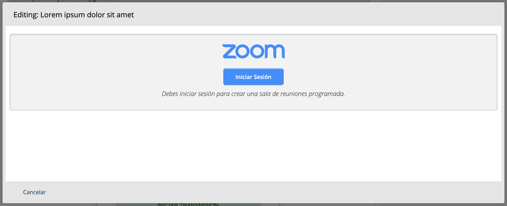
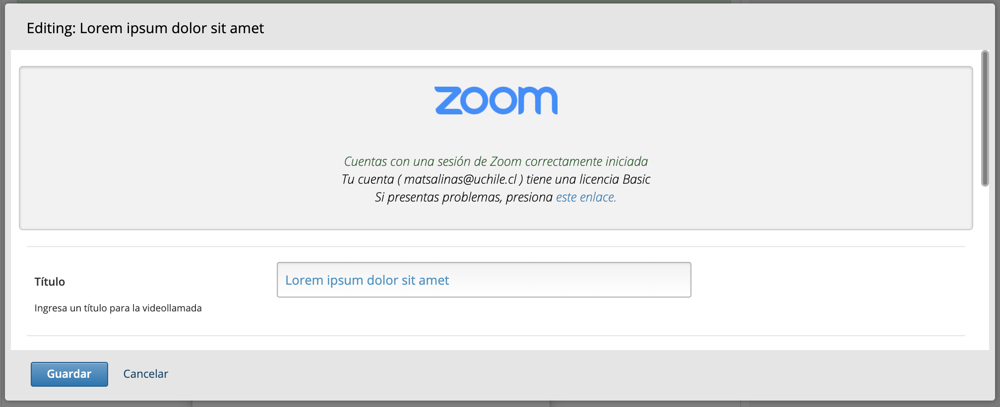
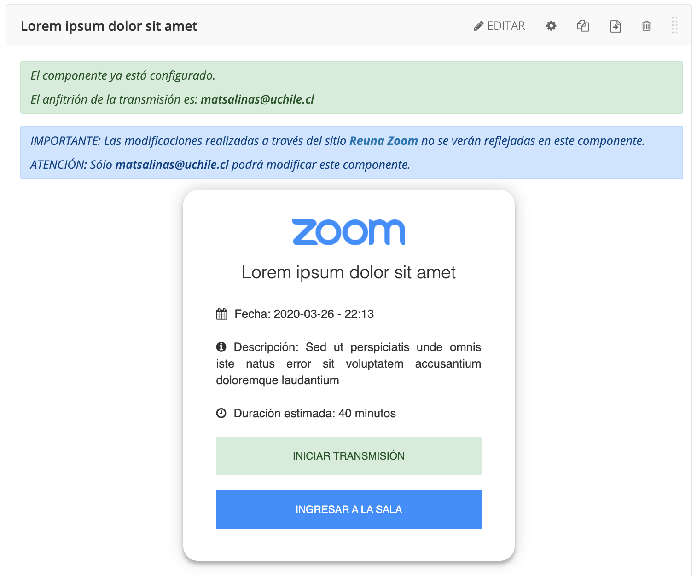
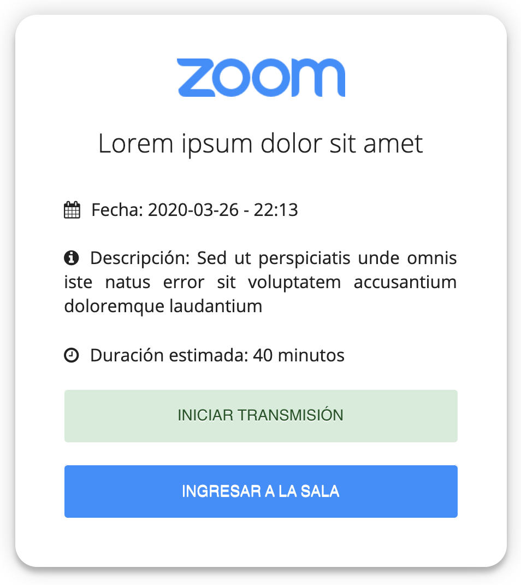
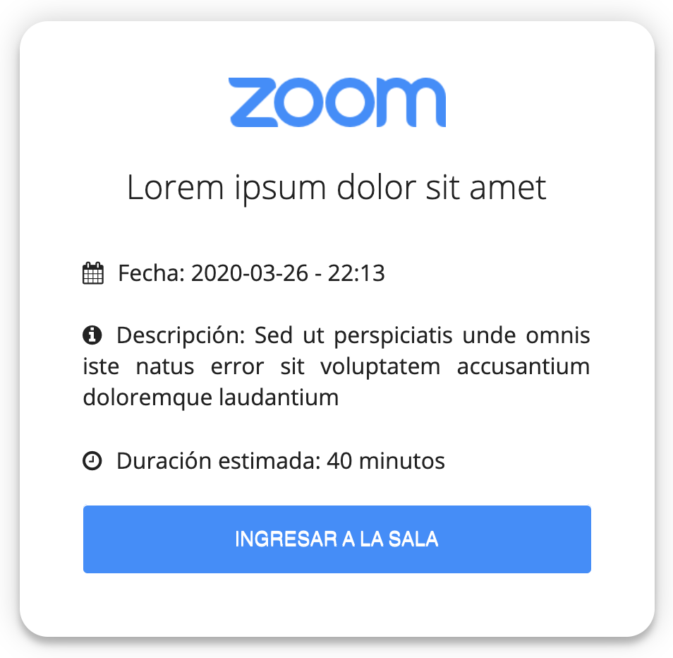

# Norteamericano Zoom XBlock

 

XBlock and API to integrate zoom with the Open edX LMS. Editable within Open edx Studio.

# TO-DO

[ ] Setup google/youtube
[ ] Youtube tests
[ ] Enable youtube on studio view

# Install

    docker-compose exec cms pip install -e /openedx/requirements/eolzoom
    docker-compose exec lms pip install -e /openedx/requirements/eolzoom
    docker-compose exec lms python manage.py lms --settings=prod.production makemigrations
    docker-compose exec lms python manage.py lms --settings=prod.production migrate

# Configuration Zoom

To enable [Zoom API](https://marketplace.zoom.us/docs/guides) Edit *production.py* in *lms and cms settings* and add your own keys and domain url.

    import base64
    EOLZOOM_CLIENT_ID = AUTH_TOKENS.get('EOLZOOM_CLIENT_ID', '')
    EOLZOOM_CLIENT_SECRET = AUTH_TOKENS.get('EOLZOOM_CLIENT_SECRET', '')
    EOLZOOM_AUTHORIZATION = base64.b64encode('{}:{}'.format(EOLZOOM_CLIENT_ID, EOLZOOM_CLIENT_SECRET).encode("utf-8")).decode("utf-8")
    EOLZOOM_DOMAIN = AUTH_TOKENS.get('EOLZOOM_DOMAIN', '')

# Configuration Zoom Event

To enable [Zoom Event API](https://marketplace.zoom.us/docs/guides/build/webhook-only-app) Edit *production.py* in *lms and cms settings* and add your own token authorization.

    EOLZOOM_EVENT_AUTHORIZATION = AUTH_TOKENS.get('EOLZOOM_EVENT_AUTHORIZATION', '')

# Configuration Youtube

To enable [Youtube API](https://developers.google.com/youtube/v3/guides/auth/server-side-web-apps) Edit *production.py* in *lms and cms settings* and add your own credentials and timezone.

    GOOGLE_CLIENT_ID = AUTH_TOKENS.get('GOOGLE_CLIENT_ID', '')
    GOOGLE_PROJECT_ID = AUTH_TOKENS.get('GOOGLE_PROJECT_ID', '')
    GOOGLE_CLIENT_SECRET = AUTH_TOKENS.get('GOOGLE_CLIENT_SECRET', '')
    GOOGLE_REDIRECT_URIS = AUTH_TOKENS.get('GOOGLE_REDIRECT_URIS', [])
    GOOGLE_JAVASCRIPT_ORIGINS = AUTH_TOKENS.get('GOOGLE_JAVASCRIPT_ORIGINS', [])
    EOLZOOM_YOUTUBE_TIMEZONE = AUTH_TOKENS.get('EOLZOOM_YOUTUBE_TIMEZONE', '')

## TESTS
**Prepare tests:**

    > cd .github/
    > docker-compose run --rm lms /openedx/requirements/eolzoom/.github/test.sh

# Screenshots
*Last Update 26/03/2020*

## CMS - Studio Edit

## CMS - Author View

## LMS - Staff View

## LMS - Student View

